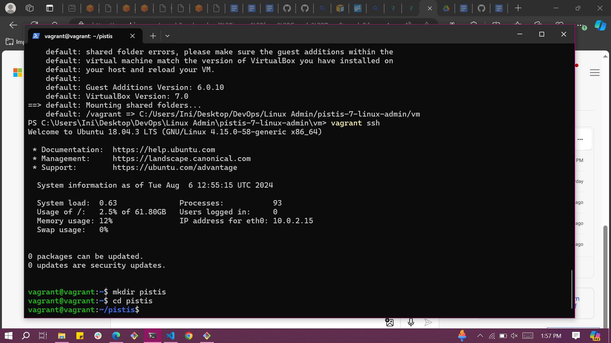
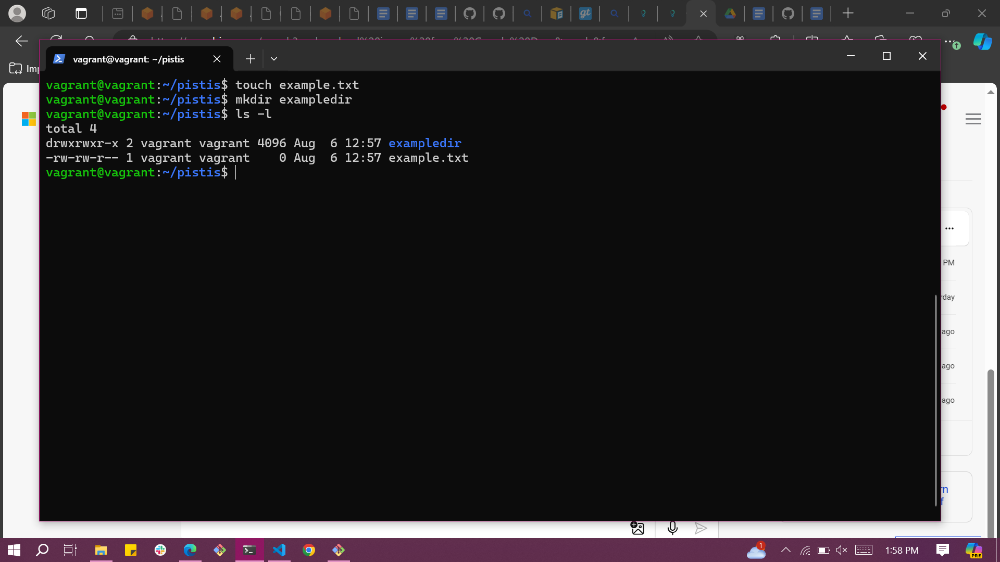
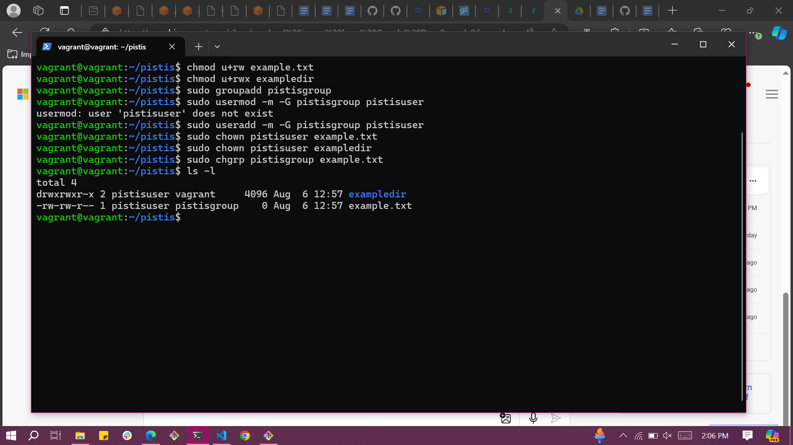
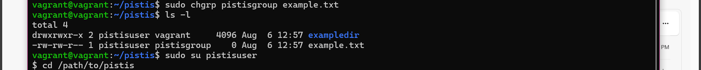

# FILE AND DIRECTORY PERMISSIONS PROJECT


File and directory permissions in Linux offers several advantages like security, access control, organization, and multi-user environment.


### Objective: 
Setting file and directory permissions on a Linux system using the chmod, chown, and chgrp commands 


### Step 1: Access the Linux System
For this project, make use of a Vagrant Linux box and access it using vagrant ssh.


### Step 2: Open a Terminal
If you're not already in a terminal session, open a terminal window. You'll use this terminal to execute commands.

### Step 3: Create and Navigate to the Directory
Create a new directory named pistis and navigate into it:
```markdown
mkdir pistis
cd pistis
```


### Step 4: Create Files and Directories
Create a sample file and directory to work with:
```markdown
touch example.txt
mkdir exampledir
```

### Step 5: List Files and Directories
List the files and directories in the current location to identify the ones you want to modify permissions for:
`ls -l`



### Step 6: Modify File Permissions (chmod)
To modify file permissions, use the chmod command followed by the desired permissions and the filename. For example, to give read and write permissions to a file named "example.txt" for the owner:
```markdown
chmod u+rw example.txt
u: Owner
+rw: Add read and write permissions
```

### Step 7: Modify Directory Permissions (chmod)
To modify directory permissions, use the chmod command similarly to modifying file permissions. For example, to give read, write, and execute permissions to a directory named "exampledir" for the owner:
```markdown
chmod u+rwx exampledir
u: Owner
+rwx: Add read, write, and execute permissions
```

### Step 8: Create a New Group
Create a new group named pistisgroup:
`sudo groupadd pistisgroup`

### Step 9: Create a New User
Create a new user named pistisuser and add them to the pistisgroup group:
`sudo useradd -m -G pistisgroup pistisuser`

### Step 10: Change File Owner (chown)
To change the owner of a file, use the chown command followed by the new owner's username and the filename. For example, to change the owner of a file "example.txt" to the user pistisuser:
`sudo chown pistisuser example.txt`

### Step 11: Change Directory Owner (chown)
To change the owner of a directory, use the chown command similarly to changing file ownership. For example, to change the owner of a directory "exampledir" to the user pistisuser:
`sudo chown pistisuser exampledir`

### Step 12: Change Group Ownership (chgrp)
To change the group ownership of a file or directory, use the chgrp command followed by the group name and the filename or directory name. For example, to change the group ownership of "example.txt" to pistisgroup:
`sudo chgrp pistisgroup example.txt`

### Step 13: Verify Permissions and Ownership
Check the permissions and ownership of files and directories to ensure they have been modified as desired:
`ls -l`


### Step 14: Test Access
Log in as the new owner (if applicable) and test access to the modified files and directories to ensure the changes are effective:
```markdown
sudo su pistisuser
cd /path/to/pistis
```
