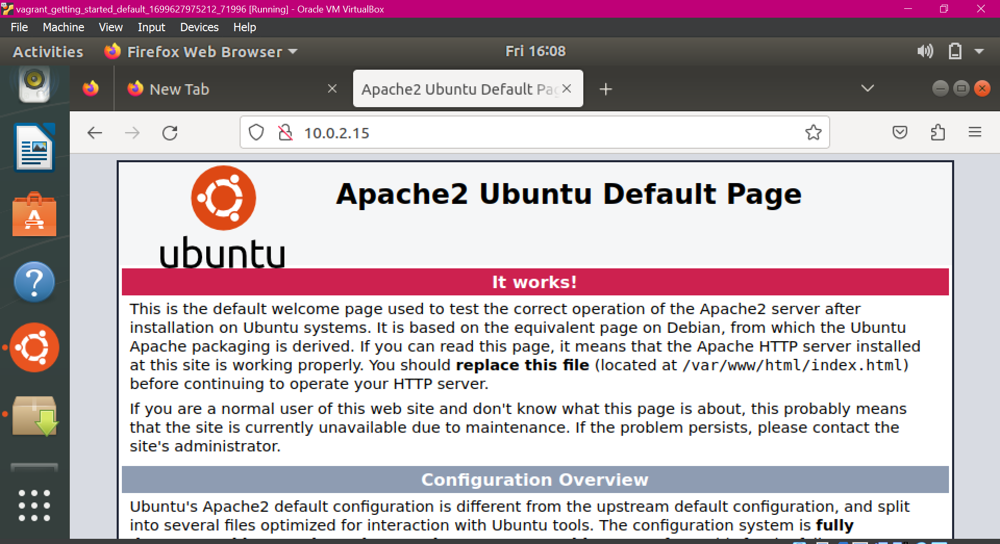
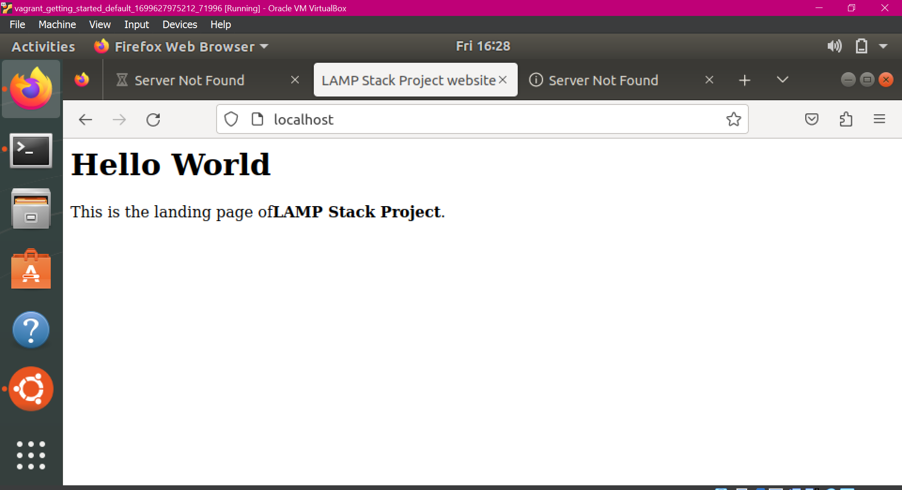
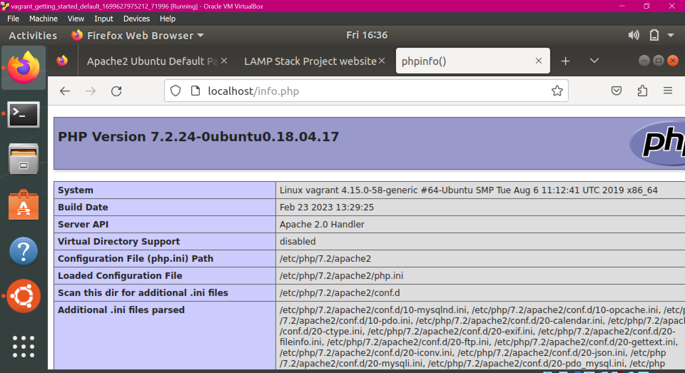

# LAMP STACK PROJECT


A “LAMP” stack is a set of open-source software that is typically installed together to enable a server to host dynamic websites and web apps written in PHP. LAMP is an acronym that represents the Linux operating system with the Apache web server. The site data is stored in a MySQL database, and dynamic content is processed by PHP.

## How to setup a LAMP stack on an Ubuntu 22.04 server 

I created a project called LAMP Stack Project to display a virtual host that served content stored in a MySQL database and processed by PHP

### Prerequisites: Ubuntu 22.04 server with a non-root sudo-enabled user account

### Step 1: Installing Apache and Updated the Firewall
- First updated package manager cache - `sudo apt update`
- Then, installed Apache - `sudo apt install apache2`
- Adjusted firewall settings to allow HTTP traffic using Ubuntu’s default firewall configuration tool called Uncomplicated Firewall (UFW) by listing currently available UFW application profiles and allowing HTTP traffic for Apache on preferred option which was on only port 80  - `sudo ufw allow app list` and `sudo ufw allow in “Apache”`
- Enabled the ufw firewall - sudo ufw enabled
Verified the change - sudo ufw status 
- Finally checked my server’s public IP address in a web browser to spot check - `http://l0.0.2.15`
- My server’s IP address was gotten from - `hostname -i`



### Step 2: Installing MySQL
- Installed the MySQL database system to store and manage data for my site - `sudo apt install mysql-server`
- When the installation finished, I ran a security script that came pre-installed to remove some insecure default settings and lock down access to my database system and this would attempt to set a password for the installation’s root MySQL account which by default on Ubuntu’s installations is not configured to connect with a password. As of July 2022, that script without some further configuration would return an error and enter into a recursive loop (after attempting to set the root account password and continue with the rest of the security prompts on it) rather than silently fail as before. In order to solve this, I entered the MYSQL console and changed the root user authentication to one that uses a password using the mysql-native_password (even though it wouldn’t require me to provide a password to connect as the root user having defined one when running the secure script because the default authentication method for the admin MySQL user is unix-socket instead of password as it allows only system users with sudo privileges to log in as the MySQL user; so setting a password for the root MySQL account is a safeguard in case the default authentication method is changed from unix_socket to password) – `sudo mysql and ALTER USER ‘root’@’localhost’ IDENTIFIED WITH mysql_native_password BY ‘password’;`
- Exited the console (with exit command), after which I was able to run the secure script, configure a more secure password and secure my MySQL server accepting the rest of the questions with a Yes such as: to remove some anonymous users and the test database, disable remote root logins and so on – `sudo mysql_secure_installation`
  
### Step 3: Installing PHP
- PHP will process code to display dynamic content to the final user. In addition to the php package, I installed `php-mysql` module to allow php communicate with MySql-based databases, and also `libapache2-mod-php` to enable Apache to handle PHP files – `sudo apt install php libapache2-mod-php php-mysql`
  
### Step 4: Creating a Virtual Host for your Website
- Created a virtual host to encapsulate configuration details and host more than one domain from a single server. Did this first to hold your website’s files and folders before testing your LAMP setup with a PHP script. First, created a directory for my virtual host (domain) in Apache default enabled virtual host configured to serve documents from the /var/www/html directory – `sudo mkdir /var/www/lampstackproject`
- Assigned ownership of the directory with the `$USER` environment variable which will reference your current system user – `sudo chown -R $USER:$USER /var/www/lampstackproject`
- Then, opened a new configuration file in Apache’s sites-available directory using a VI command-line editor and specified my domain where needed in ServerName and ServerAlias telling Apache to serve my domain using `/var/www/lampstackproject` as the web root directory – `sudo vi /etc/apache2/sites-available/lampstackproject.conf`
- After which I enabled the new virtual host with `a2ensite` – `sudo a2ensite lampstackproject`
- Disabled Apache’s default website that comes installed with Apache since I’m not using a custom domain name, so as not to override my virtual host – `sudo a2dissite 000-default`
- Confirmed my configuration file has zero syntax errors – `sudo apache2ctl configtest`
- Finally, reloaded Apache so these changes take effect and my new website becomes active – `sudo systemctl reload apache2`
- Since my web root directory `/var/www/lampstackproject` had no file yet, the virtual host didn’t serve any content even though it’s active. This was solved by creating a file e.g `index.html` in that location to test if the virtual host worked as expected. VI editor was used to edit the file to display a very basic content that greeted ‘Hello World’ – `sudo vi /var/www/lampstackproject.index.html`
- After which I opened a web browser to access my server’s domain name and view the content of the file (index.html) – `http://lampstackproject`



- Since the `index.html` file was tested successfully, I went ahead and replaced it with an index.php file to serve the main content of the domain from the `/var/www/lampstackproject` directory. But first, edited the default Apache DirectoryIndex settings that had a temporary `index.html` file always take precedence over an `index.php` file (which contained informative messages to visitors and useful for setting up maintenance pages in PHP apps which ultimately removed the index.html file once over). The `index.php` script was repositioned to come before the `index.html` file – `sudo vi /etc/apache2/mods-enabled/dir.conf`  
- Reloaded Apache once more to reflect the changes - sudo systemctl reload apache2

### Step 5: Testing PHP Processing on your Web Server
- Finally created the index.php script but as a test script first (info.php) to ensure Apache can handle and process requests for PHP files before creating main scripts – `sudo vi /var/www/lampstackproject/info.php`
```php
<?php 

phpinfo();
```
- Confirmed by visiting a web browser to access my server’s domain name or IP address followed by the name of the script – `http://lampstackproject/info.php`



- Then, removed the info.php script after checking the relevant info about my PHP server through the page since it contains relevant info and also sensitive info about my PHP environment and Ubuntu server – `sudo rm /var/www/lampstackproject/info.php`
  
### Step 6: Testing Database Connection from PHP (Optional)
- Then went on to test whether PHP can connect to MySQL and execute database queries by creating a test table with test data in MySQL database, and query for its content from a PHP script. First connected to the MySQL console – `sudo mysql -u root -p or sudo mysql`
- In the console, created a new database – `CREATE DATABASE lampstack_database;`
- Created a new user as well and granted it full privileges on the custom database created above. This user would authenticate with the default method which is caching_sha2_password method – CREATE USER ‘Todun’@’%’ IDENTIFIED BY ‘password’;
- Since some versions of PHP from PHP 7.4 below don’t work reliably with caching_sha2_password, I set root to authenticate with mysql_native_password instead to avoid encountering error trying to log in to phpMyAdmin (if need be) to ease access to MySQL console from sub-users – ALTER USER ‘root’@’localhost’ IDENTIFIED WITH mysql_native_password BY ‘password’;
- Exited the console – exit
- Then tested if the new user created i.e. Todun had the proper permissions by logging in to the MySQL console again – sudo mysql -u Todun – p. The -p flag prompted me for the password used when the user was created.
- Once back, confirmed I had access to the lampstack_database by viewing the list of databases available – SHOW DATABASES;
- Next, created a test table named todo_list –
```mysql
CREATE TABLE lampstack_database.todo_list (
    Item_id INT AUTO_INCREMENT,
    Content VARCHAR(255),
    PRIMARY KEY(item_id)
);
```
- Then inserted a few rows of content in the test table – INSERT INTO lampstack_database. todo_list (content) VALUES (“Networking”);
Confirmed the data was successfully saved to my table – SELECT * FROM lampstack_database.todo_list;
Exited the MySQL console once the confirmation was successful – exit
Next step was to create the PHP script that would connect to MySQL and query for my content. The PHP file was created in my custom web root directory using Vi editor – sudo vi /var/www/lampstackproject/todo_list.php
<?php
$user = "Todun";
$password = "password";
$database = "lampstack_database";
$table = "todo_list";


try {
  $db = new PDO("mysql:host=localhost;dbname=$database", $user, $password);
  echo "<h2>DEVOPS TOPICS TO LEARN AFTER LINUX ADMINISTRATION</h2><ol>"; 
  foreach($db->query("SELECT content FROM $table") as $row) {
    echo "<li>" . $row['content'] . "</li>";
  }
  echo "</ol>";
} catch (PDOException $e) {
    print "Error!: " . $e->getMessage() . "<br/>";
    die();
}
Finally, accessed the page in my web browser by visiting my domain name or public IP address configured for my website, followed by /todo_list.php which means my PHP environment is ready to connect and interact with my MySQL server – http://lampstackproject/todo_list.php

