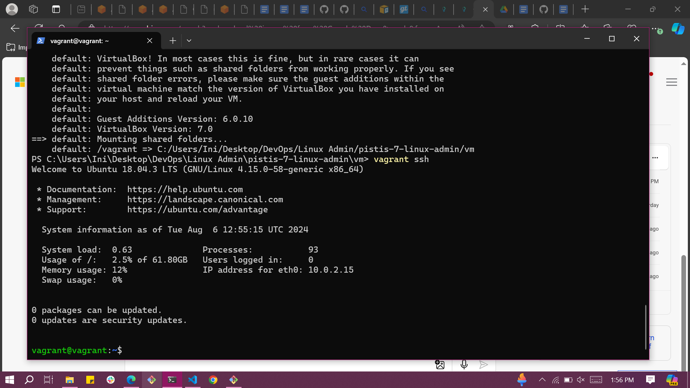

# PACKAGE MANAGEMENT PROJECT

### Objective:
Learn how to manage software packages on a Linux system using package management tools (apt, yum, or dnf).

### Step 1: Access the Linux System
For this project, make use of a Vagrant Linux box and access it using `vagrant ssh`.



### Step 2: Open a Terminal
If you're not already in a terminal session, open a terminal window. You'll use this terminal to execute package management commands.

### Step 3: Update Package Repositories
Before installing or updating packages, it's essential to update the package repositories to get the latest package information. Use the appropriate command based on your Linux distribution:

For Debian/Ubuntu (apt):
```markdown
sudo apt-get update
apt-get update
```

For Red Hat-based systems (yum or dnf):
```markdown
sudo yum update  # For older Red Hat systems
```
OR
```markdown
sudo dnf update  # For newer Red Hat systems
```


### Step 4: Install a Package
To install a new package, use the appropriate command for your package manager. Replace package-name with the name of the package you want to install.

For Debian/Ubuntu (apt):
```markdown
sudo apt-get install apache2
yum update
```

For Red Hat-based systems (yum or dnf):
```markdown
sudo yum install httpd  # For older Red Hat systems
```
OR
```markdown
sudo dnf install httpd  # For newer Red Hat systems
```


### Step 5: Remove a Package
To remove an installed package, use the appropriate command for your package manager. Replace package-name with the name of the package you want to remove.

For Debian/Ubuntu (apt):
```markdown
sudo apt-get remove apache2
apt remove
```

For Red Hat-based systems (yum or dnf):
```markdown
sudo yum remove httpd  # For older Red Hat systems
```
OR
```markdown
sudo dnf remove httpd  # For newer Red Hat systems
```


### Step 6: Search for Packages
To search for available packages, you can use the search functionality of your package manager.

For Debian/Ubuntu (apt):
```markdown
apt search keyword
apt search
```

For Red Hat-based systems (yum or dnf):
```markdown
yum search keyword  # For older Red Hat systems
```
OR
```markdown
dnf search keyword  # For newer Red Hat systems
```


### Step 7: List Installed Packages
You can list all installed packages on your system using the following command:

```markdown
For Debian/Ubuntu (apt):
dpkg --list
dpkg list

For Red Hat-based systems (yum or dnf):
rpm -qa  # For older Red Hat systems
```
OR
```markdown
dnf list installed  # For newer Red Hat systems
```


### Step 8: Upgrade Installed Packages
To upgrade installed packages to their latest versions, use the appropriate command for your package manager:

For Debian/Ubuntu (apt):
```markdown
sudo apt-get upgrade
apt upgrade
```

For Red Hat-based systems (yum or dnf):
```markdown
sudo yum upgrade  # For older Red Hat systems
```
OR
```markdown
sudo dnf upgrade  # For newer Red Hat systems
```


