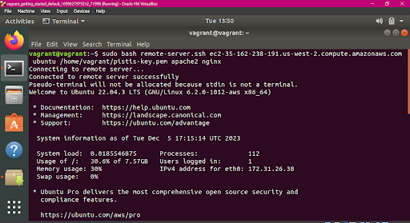
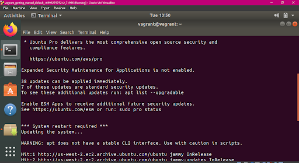

# SHELL SCRIPTING PROJECT: AUTOMATED SERVER(S) UPDATE AND WEB SERVER(S) INSTALLATION SCRIPT


Automating the deployment process of servers using shell script. The script will remotely access five servers, perform system updates, and install Apache and Nginx web servers. It also includes error checks to ensure it is run as root and provides informative error messages in case of any issues during its execution. 


### SHELL SCRIPT: remote-server.ssh
```bash
#!/bin/bash

#### Script to remotely access server(s), perform system updates, and install web servers

#### Prerequisites: Ubuntu server with a non-root sudo-enabled user account

#### Variables
SERVER_IP=$1
USERNAME=$2
PASSWORD=”$3”
WEB_SERVER1=$4
WEB_SERVER2=$5

#### Remote server access using SSH
ssh_add_key=”ssh-add $PASSWORD”
ssh_command=”ssh -i $PASSWORD $USERNAME@$SERVER_IP”

#### Process
    #### Update the system
    update_system_command=”sudo apt update && sudo apt upgrade -y”

    #### Install web servers
    install_servers_command=”sudo apt install -y $WEB_SERVER1 $WEB_SERVER2”

    #### Execute commands
    $ssh_add_key #adds the ssh key to the ssh client on the local server for ssh access to be granted and permission allowed for the script 
    $ssh_command <<EOF
    echo "Connecting to remote server..."
    # Check if root user
    if [ "$EUID" -ne 0 ]; then
        echo "This script must be run as root!"
        exit 1
    fi
    echo "Updating the system..."
    $update_system_command
    echo "System update complete. Installing $WEB_SERVER1 and $WEB_SERVER2..."
    $install_servers_command
EOF

#### Check if remote commands executed successfully
if [ $? -eq 0 ]; then
    echo "Script executed successfully! Web servers installed."
else
    echo "Error executing the script. Please check your server connection and credentials."
fi
```

RESULT OF THE SCRIPT EXECUTION
On local server (VM):






On remote server (AWS EC2 instance):

