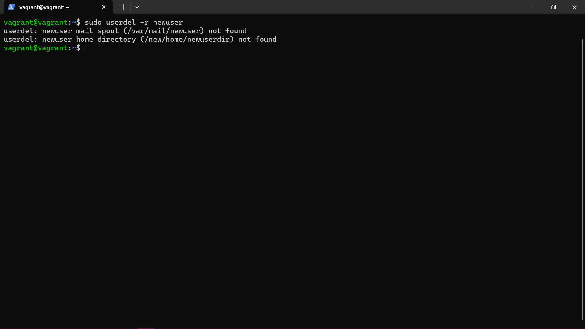

# USER AND GROUP MANAGEMENT PROJECT


### Objective:
Learn how to manage user accounts and groups on a Linux system, including creating, modifying, and deleting users and groups.

### Step 1: Access the Linux System
For this project, make use of a Vagrant Linux box and access it using `vagrant ssh`.


### Step 2: Open a Terminal
If you're not already in a terminal session, open a terminal window. You'll use this terminal to execute user and group management commands.

### Step 3: Create a New User
Create a new user using the `useradd` command. Replace `newuser` with the desired username.
```markdown
sudo useradd newuser
```


### Step 4: Set a Password for the New User
Set a password for the new user using the `passwd` command:
```markdown
sudo passwd newuser
```
You'll be prompted to enter and confirm the new password.


### Step 5: Create a New Group
Create a new group using the `groupadd` command. Replace `newgroup` with the desired group name.
```markdown
sudo groupadd newgroup
```


### Step 6: Add User to a Group
Add the newly created user to the group using the `usermod` command. Replace `newuser` with the username and `newgroup` with the group name.
```markdown
sudo usermod -aG newgroup newuser
```


### Step 7: Verify User and Group Creation
Check if the new user and group have been created successfully:
```markdown
id newuser
getent group newgroup
```


### Step 8: Modify User and Group Information
You can modify user and group information using the `usermod` and `groupmod` commands. For example, to change the user's home directory:
```markdown
sudo usermod -d /new/home/directory newuser
```


### Step 9: Delete a User
To delete a user, use the  `userdel` command. Be careful, as this will remove the user account.
```markdown
sudo userdel -r newuser
```
The `-r` flag removes the user's home directory and files associated with the user.



### Step 10: Delete a Group
To delete a group, use the `groupdel` command. Be cautious, as this will remove the group.
```markdown
sudo groupdel newgroup
```


### Step 11: Manage User Passwords (Optional)
Learn about password policies, account expiration, and other password management options for user accounts.